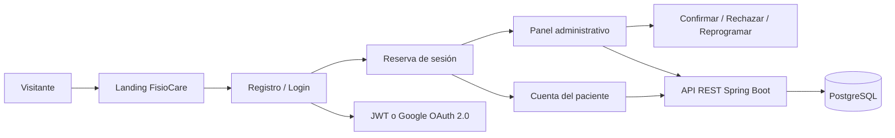

<div align="center">
  
  <h1>FisioCare</h1>
  <p><strong>Recuperación con propósito.</strong><br>Plataforma web para gestionar servicios, pacientes y reservas de fisioterapia.</p>

  <a href="https://github.com/guallycanazas/FisioCare/actions/workflows/ci.yml"></a>
  
  
  
  
  
</div>

<br>

## Sobre el proyecto

FisioCare nace para resolver un problema sencillo: una clínica de fisioterapia necesita recibir reservas, organizar su agenda y dar seguimiento a sus pacientes sin depender de mensajes dispersos o registros manuales.

La solución reúne en un solo sistema una landing page informativa, autenticación, reserva de sesiones, seguimiento del paciente y un panel administrativo. El flujo está pensado para que una persona conozca el servicio, cree su cuenta, reserve una cita y pueda revisar su estado desde cualquier dispositivo.

### Objetivo

Construir una aplicación web segura, mantenible y desplegable con contenedores que digitalice la gestión de reservas de FisioCare y demuestre el uso integrado de Angular, Spring Boot, PostgreSQL, JWT, OAuth 2.0 y Docker.

## Vista general

<div align="center">
  
</div>

## Flujo del sistema



## Funcionalidades principales

### Experiencia del paciente

- Landing pública con servicios, método de atención y llamados a la acción.
- Registro e inicio de sesión en páginas independientes.
- Continuar con Google mediante OAuth 2.0/OIDC opcional.
- Reserva paso a paso con servicio, duración, fecha y horario.
- Panel personal con próxima sesión, estadísticas e historial.
- Cancelación de reservas pendientes.

### Gestión administrativa

- Panel protegido para personal autorizado.
- Resumen de reservas pendientes, confirmadas y canceladas.
- Búsqueda y filtros por estado.
- Confirmación, rechazo, reprogramación y eliminación de reservas.
- CRUD del catálogo de servicios.
- Estados de reserva: `PENDING`, `CONFIRMED` y `CANCELLED`.

## Tecnologías utilizadas

| Área | Tecnología | Responsabilidad |
| :--- | :--- | :--- |
| Interfaz | Angular + TypeScript | Componentes, rutas, formularios y consumo de API |
| Diseño | CSS responsive | Identidad visual, layout y adaptación móvil |
| API | Spring Boot 3.3 + Java 17 | Controladores, servicios y reglas de negocio |
| Seguridad | Spring Security + JWT | Autenticación, autorización y roles |
| Contraseñas | BCrypt | Hash seguro de credenciales |
| Login social | OAuth 2.0 + OpenID Connect | Acceso opcional con Google |
| Datos | Spring Data JPA + PostgreSQL 16 | Persistencia de usuarios, servicios y reservas |
| Web server | Nginx | Servir Angular y enrutar `/api` al backend |
| Entorno | Docker Compose | Orquestar frontend, backend y base de datos |
| Calidad | Maven, JUnit y GitHub Actions | Pruebas y validación automática |

## Arquitectura del repositorio

```text
FisioCare/
├── backend/
│   ├── src/main/java/com/reservas/booking/
│   │   ├── auth/              # Registro, login y usuario actual
│   │   ├── domain/            # Entidades y enums
│   │   ├── repository/        # Repositorios JPA
│   │   ├── security/          # JWT, BCrypt y Google OAuth2
│   │   └── web/               # Controladores REST y CORS
│   ├── src/test/               # Pruebas de persistencia
│   └── Dockerfile
├── frontend/
│   ├── src/app/                # Landing, auth, reservas y dashboards
│   ├── src/public/assets/      # Logo e imágenes de la experiencia web
│   ├── nginx.conf              # Proxy frontend → backend
│   └── Dockerfile
├── compose.yaml                # Servicios Docker
├── .env.example                # Plantilla sin secretos
└── .github/workflows/ci.yml    # Integración continua
```

## Inicio rápido con Docker

### Requisitos

- Docker Desktop
- Git

### Ejecución

```bash
git clone https://github.com/guallycanazas/FisioCare.git
cd FisioCare
cp .env.example .env
docker compose up -d --build
```

### URLs locales

| Recurso | URL |
| :--- | :--- |
| Aplicación | <http://localhost:4200> |
| API | <http://localhost:8081> |
| Health check | <http://localhost:8081/api/health> |
| PostgreSQL | `localhost:5432` |

Para detener el entorno:

```bash
docker compose down
```

Los datos de PostgreSQL se conservan en el volumen `postgres_data` mientras no se elimine manualmente.

## Configuración segura

Las variables privadas deben vivir únicamente en `.env`, que está excluido del repositorio:

```env
GOOGLE_OAUTH_ENABLED=false
GOOGLE_CLIENT_ID=
GOOGLE_CLIENT_SECRET=
FRONTEND_URL=http://localhost:4200

# Opcionales: cuentas semilla solo para tu entorno local
DEMO_ADMIN_EMAIL=
DEMO_ADMIN_PASSWORD=
DEMO_CUSTOMER_EMAIL=
DEMO_CUSTOMER_PASSWORD=
```

En un entorno público configura además un `JWT_SECRET` fuerte, una contraseña segura de base de datos y la URL HTTPS real del frontend. No se publican credenciales demo en la interfaz, documentación ni código.

## Google OAuth 2.0

1. Crea un cliente OAuth de tipo **Aplicación web** en Google Cloud.
2. Configura las variables de Google y cambia `GOOGLE_OAUTH_ENABLED=true`.
3. Registra la URI de retorno según el entorno:

```text
http://localhost:8081/login/oauth2/code/google
```

Para un túnel o dominio público:

```text
https://tu-dominio.com/login/oauth2/code/google
```

La aplicación recibe la identidad de Google y genera un JWT interno para proteger las operaciones de reservas.

## API REST

| Método | Endpoint | Acceso |
| :---: | :--- | :--- |
| `GET` | `/api/health` | Público |
| `POST` | `/api/auth/register` | Público |
| `POST` | `/api/auth/login` | Público |
| `GET` | `/api/auth/providers` | Público |
| `GET` | `/api/services` | Público |
| `POST` | `/api/reservations` | Cliente |
| `GET` | `/api/reservations/mine` | Cliente |
| `PATCH` | `/api/reservations/{id}/cancel` | Cliente propietario |
| `GET` | `/api/reservations` | Administrador |
| `PATCH` | `/api/reservations/{id}/status` | Administrador |
| `PUT` | `/api/reservations/{id}` | Administrador |
| `DELETE` | `/api/reservations/{id}` | Administrador |
| `POST` / `PUT` / `DELETE` | `/api/services` | Administrador |

## Pruebas y calidad

Backend:

```bash
cd backend
mvn test
```

Frontend:

```bash
cd frontend
npm ci
npm run build -- --configuration production
```

GitHub Actions ejecuta el build de Angular y las pruebas Maven en cada cambio de `main`.

## Compartir desde tu máquina

Para una demostración temporal puedes exponer el frontend local sin abrir puertos del router:

```bash
cloudflared tunnel --url http://localhost:4200
```

La URL pública funciona mientras Docker y el túnel estén activos. Para producción se recomienda usar un dominio propio, HTTPS permanente, variables secretas y una base de datos administrada.

## Documentación adicional

- [Informe del proyecto en Overleaf](outputs/FisioCare_Overleaf/LEEME.txt)
- [Guion de demostración](outputs/Guion_Demo_FisioCare.md)
- [Presentación de sustentación](outputs/FisioCare_Presentacion_Sustentacion.pptx)

## Repositorio

<https://github.com/guallycanazas/FisioCare>

<div align="center">
  <sub>Desarrollado para Computación e Informática · FisioCare © 2026</sub>
</div>
